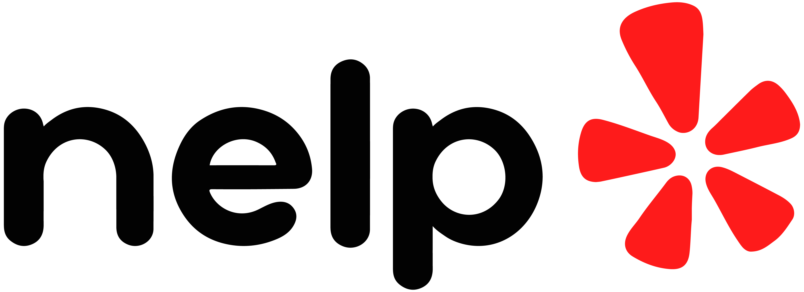

  

# NELP app!
nelp app is a small project using React to search Naperville businesses 

## What does nelp depend on?
nelp is pretty simple:

This project was bootstrapped with [Create React App](https://github.com/facebook/create-react-app).

Also:
* [Axios](https://axios-http.com/)
* [React Router](https://reactrouter.com/)
* [react-dotenv](https://www.npmjs.com/package/react-dotenv)
* Because the yelp fusion API requires CORS anywhere, youll have to 
  go [here](https://cors-anywhere.herokuapp.com/corsdemo) to temporarily whitelist your browser with the CORS Anywhere server (otherwise you'd have to build your own CORS servers)

## Config
1. Clone the repo

2. after installing npm and site dependencies, navigate into 
the root project directory, you can run:

### `npm start`

which Runs the app in the development mode.\
Open [http://localhost:3000](http://localhost:3000) to view it in the browser.

The page will reload if you make edits.\
You will also see any lint errors in the console.

### `npm test`

Launches the test runner in the interactive watch mode.\
See the section about [running tests](https://facebook.github.io/create-react-app/docs/running-tests) for more information.

## Overview

Nelp 